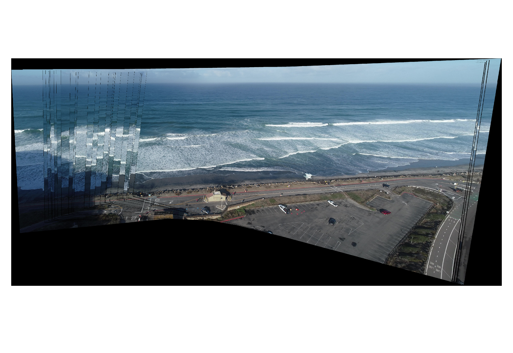

# Statement of need
Uncrewed aerial vehicles (UAVs) are an important tool for coastal monitoring with their relatively low-cost and rapid deployment capabilities. To generate scientific-grade image products, to use for wave runup observations, for bathymetry inversions, or tracking surfzone currents, the hovering UAV images/videos must be stabilized and rectified into world coordinates. Due to the limited stationary region of coastal images suitable for control points, the processing of  UAV-obtained videos can be time-consuming and resource-intensive. The [CIRN Qualitative Coastal Imagining Toolbox](https://github.com/Coastal-Imaging-Research-Network/CIRN-Quantitative-Coastal-Imaging-Toolbox)[@bruder:2020] provided a first-of-its-kind open-sourced code for rectifying these coastal UAV videos. Limitations of the toolbox, however, prompted the development of CoastalLens with an efficient data input procedure, providing capabilities to obtain drone position (extrinsics) from LiDAR surveys, and using a feature detection and matching algorithm to stabilize the video prior to rectification. This framework reduces the amount of human oversight, now only required during the data input processes. Removing the dependency on threshold stability control points provides more stable results and can also result in less time in the field. We hope this framework will allow for more efficient processing of the ever-increasing coastal UAV datasets. 

# Summary
CoastalLens is set up as 4 scripts (with an optional 5th script) run sequentially from a main entry point script (``UAV_rectification.m``). This allows users to execute parts or all of the full framework depending on their workflow. The first script, ``input_day_flight_data.m``, prompts user input and returns all the user-specified required input data organized in stuctures to be used by the subsequent scripts. The user is required to input data for each day and flight to process. Required user inputs are the video timezone, camera intrinsics, the Products (types of images) to be generated (e.g. Grid/Rectified Image, xTransect or yTransect), and the ground control points to determine the camera world position (via GPS points or pointcloud) ([@hartley:2004], [@gao:2003], [@conlin:2020]). Users can load in pre-set values for the relevant day-specific information from a configuration file. This is useful if similar UAV missions are flown repeatedly at the same location. The second script, ``extract_images_from_UAV.m``, extracts images from the video files at the specified frame rates. This is done via a system command to the ffmpeg command line tool. 
The third script, ``stabilize_video.m``, accounts for the UAV movement and returns the 2D projective transformation of the image to improve image stabilization through flight. We take an approach similar to constructing a panorama image. Static features (e.g. corners, windows, lines on the ground) are found in every frame. In subsequent frames, these features are matched and the movement/change in location of these features between the frames is used to estimate the change in position of frame 2 versus frame 1. This is used to warp the image into fitting into the full ‘panorama’ image. This approach allows for good estimates to be obtained even in cases where the UAV drift substantially ([@brown:2007], [@torr:2000]). From these stabilized images we can produce standard ARGUS products, like time-averaged images, brightest and darkest image [@holman:2007]. In the final main script, ``get_products.m``, the image coordinates corresponding to the world coordinates of the previously defined products are determined. These image coordinates are used to extract the pixels from each frame. ``save_products.m`` is an optional code to save the resulting rectified images as png’s.

![Figure 1: Example of matched features and the 2D projective transformation of the image. (left) Image 1 (red) and Image 2 (blue) are taken 1 minute apart (extreme case) and features have been detected and matched between the two frames. Note the shift in the lifeguard tower on the right, or the pedestrian crosswalk in the middle of the image. (right) Image 1 (green) and Image 2 (purple) shown after they have been warped into the ‘panorama’ image. Note large grey region at the bottom and the horizon at the top of the image where the two frames match and the stabilization has succeeded.\label{fig:1}](get_extrinsics_fd_example.png)

# Acknowledgements
This study was funded by the U.S. Army Corps of Engineers (W912HZ1920020) and the California Department of Parks and Recreation (C19E0026). Thank you to Rob Grenzeback, Julia Fiedler, Alex Simpson and Holden Leslie-Bole for help collecting this data and testing the framework. 

# References
